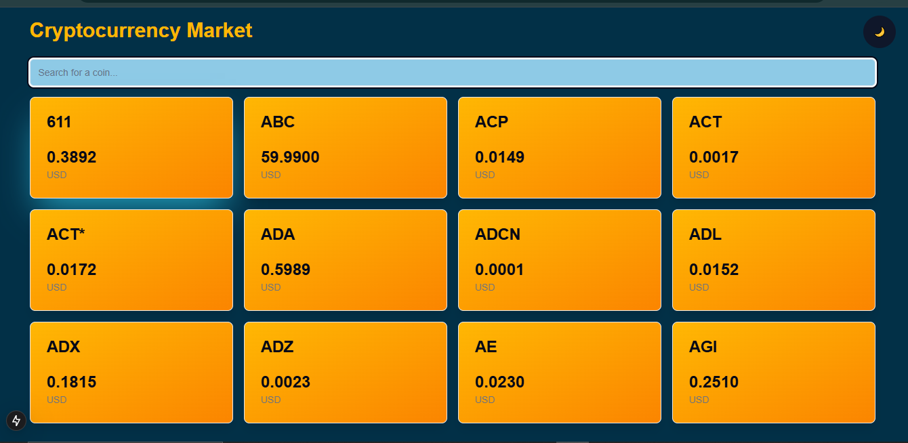
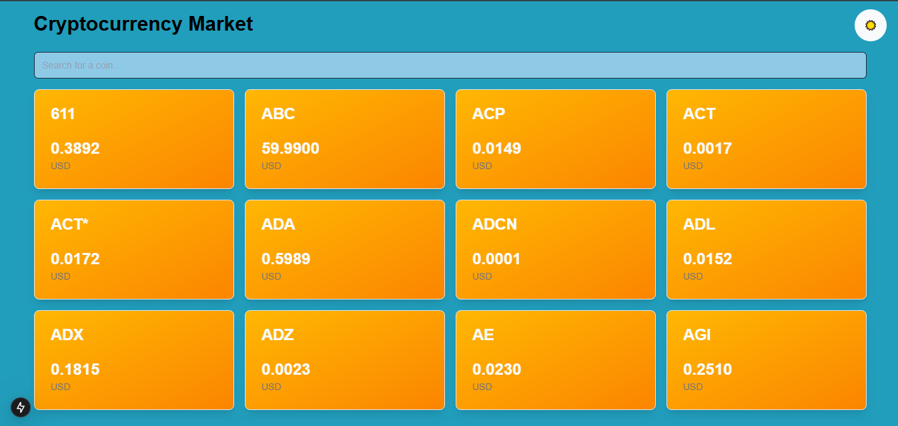

# 🚀 Cryptocurrency Market

**Cryptocurrency Market** is a sleek web application that enables users to view live cryptocurrency exchange rates. Built with modern tools and libraries, this app offers an engaging interface for tracking the latest cryptocurrency prices in real-time.

 

## 📋 Table of Contents

- [🚀 Cryptocurrency Market](#-cryptocurrency-market)
  - [📋 Table of Contents](#-table-of-contents)
  - [✨ Features](#-features)
  - [🖥️ Demo](#️-demo)
  - [🛠️ Tech Stack](#️-tech-stack)
  - [🚀 Getting Started](#-getting-started)
    - [Prerequisites](#prerequisites)
    - [Installation](#installation)
  - [🔧 Environment Variables](#-environment-variables)
  - [🎮 How to Use](#-how-to-use)
    - [Screenshots](#screenshots)

---

## ✨ Features

- **Real-Time Cryptocurrency Rates**: View updated exchange rates for various cryptocurrencies.
- **Search Functionality**: Easily search and filter specific cryptocurrencies by name.
- **Responsive Design**: Built with Tailwind CSS, ensuring a seamless experience across devices.
- **Dark Mode**: Toggle between light and dark themes for a personalized experience.
- **Smooth Animations**: Each coin card animates upon scroll for an engaging user experience.

---

## 🖥️ Demo

[Live Demo](https://q2-class-assignments-7fc7.vercel.app/)

---

## 🛠️ Tech Stack

This application is built with the following technologies:

- **[Next.js 15](https://nextjs.org/)** - A modern React framework for optimized web applications
- **[React 19](https://reactjs.org/)** - A JavaScript library for building interactive UIs
- **[TypeScript](https://www.typescriptlang.org/)** - A typed superset of JavaScript for scalable and maintainable code
- **[Tailwind CSS](https://tailwindcss.com/)** - A utility-first CSS framework for styling
- **[ShadCN UI Kit](https://shadcn.dev/)** - A customizable UI component library for consistent styling
- **[Coinlayer API](https://coinlayer.com/)** - A RESTful API providing real-time cryptocurrency data

---

## 🚀 Getting Started

### Prerequisites

Ensure you have Node.js and npm installed:

```bash
# Node.js
https://nodejs.org/

# Check Node.js version
node -v

# Check npm version
npm -v
```

### Installation

1. **Clone the Repository**

   ```bash
   git clone https://github.com/your-username/cryptocurrency-market.git
   cd cryptocurrency-market
   ```

2. **Install Dependencies**

   ```bash
   npm install
   ```

3. **Set Up Environment Variables**

   Create a `.env.local` file in the root directory and add your API key as shown below:

   ```plaintext
   NEXT_PUBLIC_API_KEY=your_coinlayer_api_key
   ```

4. **Run the Application**

   ```bash
   npm run dev
   ```

   The application will be available at `http://localhost:3000`.

---

## 🔧 Environment Variables

The following environment variable is required to run this project:

| Variable Name          | Description                                 |
| ---------------------- | ------------------------------------------- |
| `NEXT_PUBLIC_API_KEY`  | API key for accessing Coinlayer cryptocurrency data |

To get an API key, [sign up on Coinlayer](https://coinlayer.com/).

---

## 🎮 How to Use

1. **Search for Cryptocurrencies**: Use the search bar to find specific cryptocurrencies by name.
2. **View Updated Rates**: Scroll to view live rates for each listed cryptocurrency.
3. **Dark Mode**: Toggle between light and dark modes using the dark mode toggle.

### Screenshots

- **Light Mode**

   
- **Dark Mode**

   